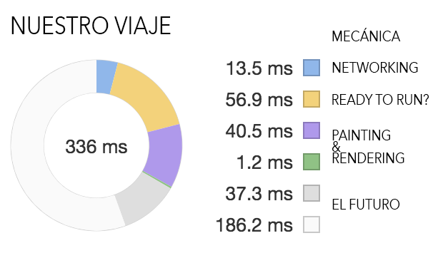

# El navegador no es un condesador de fluzo, y lo sabes... ¿o no?

# Las Slides

[We Are Not Experts - Tu navegador](https://docs.google.com/presentation/d/1WD4Va-X1MWvlBYFbCeDOoLFQJ2YW5AqWnonmApZ4bb8/edit?usp=sharing)

## Hilo Conductor

Siempre es importante ofrecer alguna **metáfora** que ayude a contar una historia. En nuestro caso, creemos que el mundo del motor da mucho juego, porque hay cosas que suceden en el navegador que tienen su paralelismo con el mundo de los coches.

Para eso os proponemos un viaje en el que iremos pasando desde que un usuario introduce una URL en su navegador, hasta que puede interactuar con ella:

> Las paradas por las que haremos este viaje son :
- **Mecánica**
- **Networking & CO**
- **Ready to Run?** (Parseado y compilado - Event Loop)
- **Painting & Rendering**
- **El Futuro**

> Recursos de la charla sobre Navegadores en el FrontFest 2018

## Recursos

### Mecánica

- [Progressive Performance (Chrome Dev Summit 2016)](https://www.youtube.com/watch?v=4bZvq3nodf4&feature=youtu.be&t=13m19s)

- [WEB API's list](https://platform.html5.org/)

- [Browser Engine](https://www.slideshare.net/Geeks_Lab/js-lab16-60222545)

- [Wikipedia - List of Rendering Engines](https://en.wikipedia.org/wiki/List_of_layout_engines)

- [Wiki Mozilla - Quantum](https://wiki.mozilla.org/Quantum)

- [Forging Better Tools for the Web](https://hacks.mozilla.org/2018/02/forging-better-tools-for-the-web/?utm_source=dev-newsletter)

### Network & Co

- [SmashingConf London — Ilya Grigorik on How’s the UX on the Web, Really?](https://vimeo.com/254834890)

- [HTTPArchive - Chrome User Experience Report](https://beta.httparchive.org/reports/chrome-ux-report)

- [BigQuery y HTTP Archive - How to use it with Rick Viscomi](https://www.youtube.com/watch?v=00f9kza3BJ0)

- [Rick Viscomi Gists](https://gist.github.com/rviscomi)

- [Ilya's gists HTTPArchive](https://gist.github.com/igrigorik/5801492)

- [The performance impact of cryptocurrency mining on the web HTTPArchive](https://discuss.httparchive.org/t/the-performance-impact-of-cryptocurrency-mining-on-the-web/1126/8)

- [Referencia al Standard-SQL usado en BigQuery](https://cloud.google.com/bigquery/docs/reference/standard-sql/)

- [CHROME URLS](https://fossbytes.com/complete-list-of-secret-chrome-urls-uses/)

- [CHROME NET-INTERNALS](https://www.youtube.com/watch?v=bG2GhHkPP4Q)

- [Decrypting TLS Traffic with Wireshark](https://jimshaver.net/2015/02/11/decrypting-tls-browser-traffic-with-wireshark-the-easy-way/)

- [Test your H2 spec implementation](https://github.com/summerwind/h2spec)

### Ready to Run?

- [The Anatomy of a Frame](https://aerotwist.com/blog/the-anatomy-of-a-frame/)

- [SmashingConf London 2018 - Jake Archibald - "The Event Loop"](https://vimeo.com/254947206)

- [In The Loop](https://www.youtube.com/watch?v=cCOL7MC4Pl0&feature=youtu.be&t=1763)

- [Loupe](http://latentflip.com/loupe/)
- [Understanding JS: The Event Loop](https://hackernoon.com/understanding-js-the-event-loop-959beae3ac40)

- [Catapulth](https://github.com/catapult-project/catapult)

- [jankfree](http://jankfree.org/)

### Painting & Rendering

- [First Meaningful Paint UMA](https://groups.google.com/a/chromium.org/forum/#!topic/loading-dev/xnwvp0XGcWI)

- [Time to First Meaningful Paint UMA](https://docs.google.com/document/d/1vi-5Oa7EFfcJXug8x-pxVw343GNr3SZmKF39DSuB9rw/edit#)
- [Time to First Meaningful Paint](https://docs.google.com/document/d/1BR94tJdZLsin5poeet0XoTW60M0SjvOJQttKT-JK8HI/view#heading=h.tdqghbi9ia5d)

### El Futuro

- [Using Headless Mode in Firefox](https://hacks.mozilla.org/2017/12/using-headless-mode-in-firefox/)

- [Firefox DevTools](http://firefox-dev.tools/)
- [Chrome Frame Viewer Overview and Getting Started](https://www.chromium.org/developers/how-tos/trace-event-profiling-tool/frame-viewer)

### A quién seguir en Twitter

- [Firefox DevTools](https://twitter.com/FirefoxDevTools)
- [ChromeDevTools](https://twitter.com/ChromeDevTools)
- [Chrome Developers](https://twitter.com/ChromiumDev)
- [DevTools Commits](https://twitter.com/DevToolsCommits)
- [Lighthouse](https://twitter.com/____lighthouse)
- [DevTools Tips](https://twitter.com/devtoolstips)
- [Dev Tool Secrets](https://twitter.com/devtoolsecrets)
- [V8](https://twitter.com/v8js)
- [Microsoft Edge Dev](https://twitter.com/MSEdgeDev)
- [Microsoft Edge DevTools](https://twitter.com/EdgeDevTools)
- [Umar Hansa](https://twitter.com/umaar)
- [Addy Osmani](https://twitter.com/addyosmani)
- [Paul Irish](https://twitter.com/paul_irish)
- [Ilya Grigorik](https://twitter.com/igrigorik)
- [Paul Lewis](https://twitter.com/aerotwist)
- [Jake Archibald](https://twitter.com/jaffathecake)
- [Surma](https://twitter.com/DasSurma)
- [Alex Russell](https://twitter.com/slightlylate)
